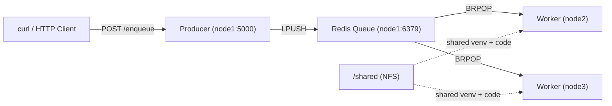

# Distributed Systems Cluster — Walkthrough

## 1. Cluster Configuration
- Fixed PowerShell variable interpolation bugs in [configure_cluster.ps1](file:///c:/Users/Admin/Desktop/Multipass_Cluster/configure_cluster.ps1) (`${var}` syntax for variables followed by colons)
- Ran [configure_cluster.ps1](file:///c:/Users/Admin/Desktop/Multipass_Cluster/configure_cluster.ps1) to set up:
  - **NFS Server** on node1, exporting `/shared`
  - **NFS Clients** on node2 and node3, mounting `/shared`
  - **Docker** verified on all 3 nodes

## 2. Redis Fix & Distributed App Deployment
- Fixed Redis bind address in [deploy_app.ps1](file:///c:/Users/Admin/Desktop/Multipass_Cluster/deploy_app.ps1) (`0.0.0.0` instead of `0.0.0.1`)
- Fixed SFTP file transfer paths in [deploy_app.ps1](file:///c:/Users/Admin/Desktop/Multipass_Cluster/deploy_app.ps1) (multipass transfer syntax)
- Appended `bind 0.0.0.0` and `protected-mode no` to `/etc/redis/redis.conf` on node1 so workers on remote nodes can connect
- Created **systemd service units** for reliable process management (instead of `nohup` which doesn't persist via `multipass exec`):
  - `producer.service` on node1 — Flask API on port 5000
  - `worker.service` on node2 and node3 — Python workers consuming from Redis queue

## 3. End-to-End Test Results ✅

### Jobs Submitted (via producer on node1)
| # | Task Name | Queue Response |
|---|-----------|---------------|
| 1 | `AnalyzeDatasetA` | Enqueued successfully |
| 2 | `AnalyzeDatasetB` | Enqueued successfully |
| 3 | `ProcessImageBatch` | Enqueued successfully |
| 4 | `TrainModelAlpha` | Enqueued successfully |

### Worker Processing
| Node | Tasks Processed |
|------|----------------|
| **node2** | `AnalyzeDatasetA`, `AnalyzeDatasetB`, `TrainModelAlpha` |
| **node3** | `ProcessImageBatch` |

### Architecture Diagram

> [!TIP]
> The workers compete for tasks using Redis `BRPOP`, which provides fair distribution — each task is processed by exactly one worker.
